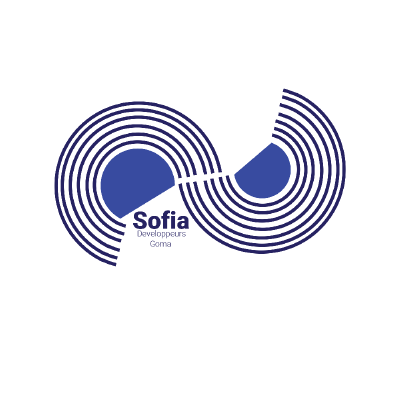

<!-- Banner Image -->

<p align="center">
  <a href="https://github.com/organizations/sofiatechnology/">
    
    <h1 align="center">SOFIA Tech</h1>
  </a>
</p>

<p align="center">
   <a aria-label="SDK version" href="https://www.npmjs.com/package/expo" target="_blank">
    
  </a>
  <a aria-label="Chat or ask a question" href="https://chat.expo.dev" target="_blank">
    
  </a>
  <a aria-label="Expo is free to use" href="https://github.com/expo/expo/blob/main/LICENSE" target="_blank">
    
  </a>
  <a aria-label="expo downloads" href="http://www.npmtrends.com/expo" target="_blank">
    
  </a>
</p>

<p align="center">
  <a aria-label="expo documentation" href="https://docs.expo.dev">Read the Documentation</a>
&ensp;•&ensp;
  <a aria-label="expo documentation" href="https://expo.dev/blog">Learn more on our blog</a>
&ensp;•&ensp;
  <a aria-label="expo documentation" href="https://expo.canny.io/feature-requests">Request a feature</a>
</p>

<h6 align="center">Follow us on</h6>
<p align="center">
  <a aria-label="Follow @expo on X" href="https://x.com/intent/follow?screen_name=expo" target="_blank">
    
  </a>&nbsp;
  <a aria-label="Follow @expo on GitHub" href="https://github.com/sofiatechnology" target="_blank">
    
  </a>&nbsp;
  <a aria-label="Follow @expo on Reddit" href="https://www.reddit.com/r/expo/" target="_blank">
    
  </a>&nbsp;
  <a aria-label="Follow @expo on Bluesky" href="https://bsky.app/profile/expo.dev" target="_blank">
    
  </a>&nbsp;
  <a aria-label="Follow @expo on LinkedIn" href="https://www.linkedin.com/company/expo-dev" target="_blank">
    
  </a>
</p>

## React Native Paper boilerplate

React Native Paper Boilerplate is a pre-configured starter template for building mobile apps with React Native and the React Native Paper library. It includes essential UI components based on Material Design, such as buttons, cards, and dialogs, providing a clean and customizable foundation to speed up development and ensure a consistent design throughout your app.

## Installation

Install my-project with yarn

```bash
  git clone https://github.com/sofiatechnology/boilerplate-react-native-paper/
  yarn install my-project
  cd my-project
```

## 💙 The Team

Curious about who makes React Native Paper Boilerplate? Here are our team members!

<a href="https://github.com/sofiatechnology/boilerplate-react-native-paper/graphs/contributors">
  
</a>

## License

This project is licensed under the Apache-2.0 License.